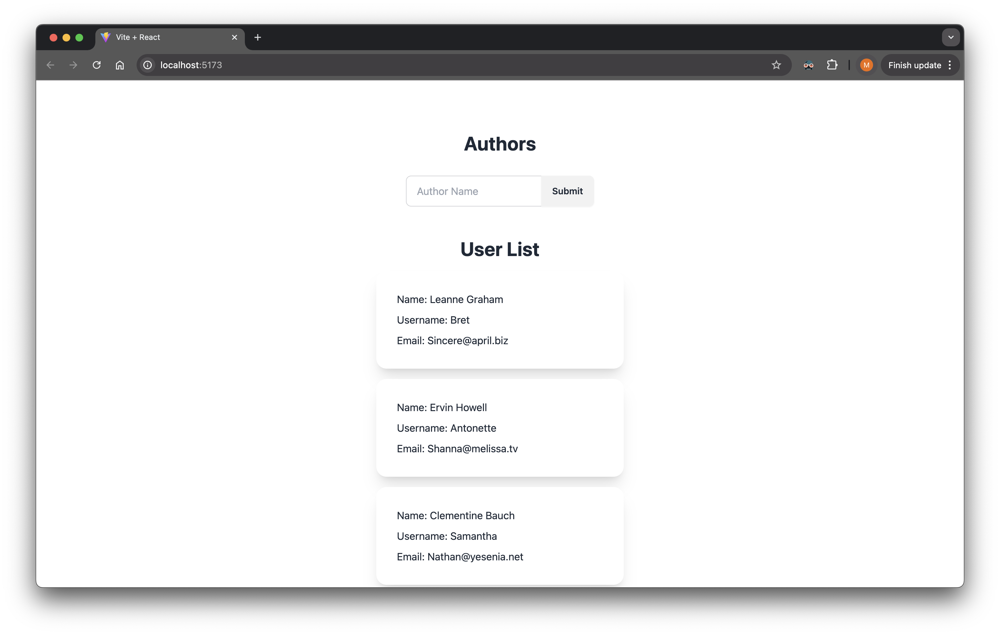

# assessment1-app



## Getting Started

Run the following commands to run this application on your local machine.

### Clone this repository

```bash
git clone https://github.com/martinng01/assessment1.git
cd assessment1
```

### Setting up the environment

Install npm dependencies

```bash
npm install
```

### Running the application

```bash
npm run dev
```

Visit the localhost website specified in terminal window.

### Testing the application

This project uses Vitest and React Testing Library for testing. To run the tests, execute:

```bash
npm test
```

## Technologies

The project was created with:

- ReactJS
- Vite
- Tailwind CSS
- DaisyUI Component Library
